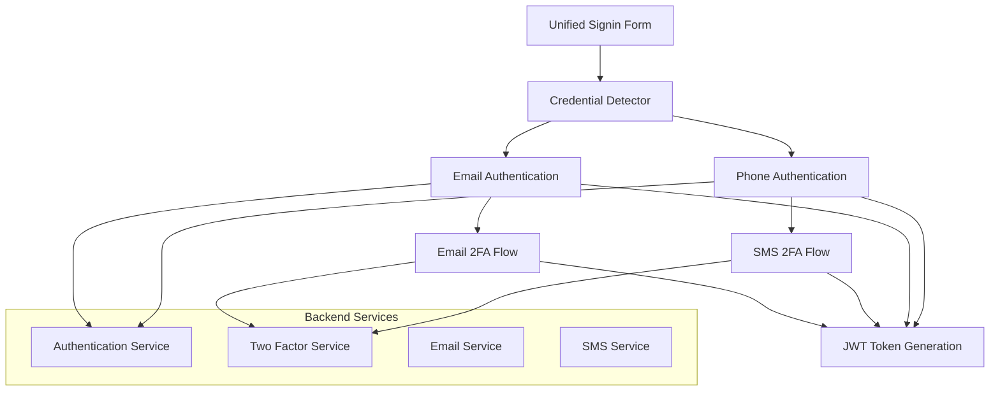

# Design Document: Flexible Signin Credentials

## Overview

This design enhances the existing wedding platform authentication system to support flexible signin credentials, allowing users to authenticate using either their email address or phone number through a single, unified input field. The system will automatically detect the credential type and route authentication accordingly while maintaining full backward compatibility with existing flows.

The enhancement builds upon the existing authentication infrastructure, including the current email-based login system, phone-based 2FA system, and SMS services. The design ensures seamless integration with existing 2FA flows and maintains all current security standards.

## Architecture

### High-Level Architecture



### Component Integration

The flexible signin system integrates with existing components:

- **Frontend**: Enhances existing `LoginForm.tsx` component
- **Backend**: Extends existing `/api/v1/auth/login` endpoint
- **Authentication Context**: Updates `AuthContext.tsx` to support unified signin
- **2FA System**: Leverages existing 2FA infrastructure for both email and SMS flows
- **Database**: Uses existing user table structure with email and phone columns

## Components and Interfaces

### Frontend Components

#### Enhanced LoginForm Component

```typescript
interface FlexibleLoginFormProps {
  onSuccess?: (user?: any) => void;
}

interface LoginFormData {
  credential: string; // Unified input for email or phone
  password: string;
}

interface CredentialDetectionResult {
  type: 'email' | 'phone' | 'invalid';
  normalizedValue: string;
  isValid: boolean;
  errorMessage?: string;
}
```

#### Credential Detector Utility

```typescript
interface CredentialDetector {
  detectCredentialType(input: string): CredentialDetectionResult;
  validateEmail(email: string): boolean;
  validatePhone(phone: string): boolean;
  normalizePhone(phone: string): string;
}
```

### Backend Interfaces

#### Enhanced Authentication Service

```typescript
interface AuthenticationRequest {
  credential: string;
  password: string;
  credentialType?: 'email' | 'phone'; // Optional hint from frontend
}

interface AuthenticationResponse {
  success: boolean;
  requires2FA?: boolean;
  user?: User;
  access_token?: string;
  message?: string;
}

interface CredentialLookupResult {
  user: User | null;
  credentialType: 'email' | 'phone';
  found: boolean;
}
```

#### Updated Authentication Endpoint

The existing `/api/v1/auth/login` endpoint will be enhanced to support both email and phone credentials:

```typescript
// Enhanced login endpoint
POST /api/v1/auth/login
{
  credential: string; // Email or phone number
  password: string;
}

// Response remains the same as current implementation
{
  access_token?: string;
  requires2FA?: boolean;
  user?: User;
  message: string;
}
```

## Data Models

### Existing User Model (No Changes Required)

The current user table structure already supports both email and phone authentication:

```sql
users {
  id: INTEGER PRIMARY KEY
  email: VARCHAR(255) -- Can be null for phone-only users
  phone: VARCHAR(20)  -- Can be null for email-only users
  password_hash: VARCHAR(255)
  user_type: VARCHAR(50)
  auth_provider: VARCHAR(50)
  is_active: BOOLEAN
  two_factor_enabled: BOOLEAN
  created_at: TIMESTAMP
  last_login_at: TIMESTAMP
}
```

### Credential Detection Logic

The system will use the following logic to detect credential types:

1. **Email Detection**: Contains "@" symbol and matches email regex pattern
2. **Phone Detection**: Contains only digits, spaces, hyphens, parentheses, and plus signs
3. **Validation**: Apply appropriate validation rules based on detected type

## Correctness Properties

*A property is a characteristic or behavior that should hold true across all valid executions of a system-essentially, a formal statement about what the system should do. Properties serve as the bridge between human-readable specifications and machine-verifiable correctness guarantees.*

Based on the requirements analysis, the following properties ensure the flexible signin system works correctly:

**Property 1: Credential Detection Accuracy**
*For any* valid email address or phone number input, the credential detector should correctly identify the type and return the appropriate classification
**Validates: Requirements 1.2, 4.1, 4.2, 4.5**

**Property 2: Input Validation Consistency**
*For any* credential input, the system should validate the format according to the detected type's rules before attempting authentication
**Validates: Requirements 1.1, 2.2, 3.2**

**Property 3: Authentication Routing**
*For any* valid credential, the system should route to the appropriate authentication method (email or phone) based on the detected credential type
**Validates: Requirements 2.1, 3.1**

**Property 4: Error Handling Consistency**
*For any* authentication failure, the system should return error messages that are consistent with existing patterns and provide actionable feedback
**Validates: Requirements 2.3, 3.4, 6.3**

**Property 5: 2FA Integration**
*For any* user with 2FA enabled, the system should trigger the appropriate 2FA method (email or SMS) based on the signin credential type used
**Validates: Requirements 5.1, 5.2, 5.3**

**Property 6: Backward Compatibility**
*For any* existing user account, the enhanced signin system should maintain the same authentication behavior as the current system
**Validates: Requirements 2.4**

**Property 7: UI State Management**
*For any* credential type detection or authentication state change, the UI should provide appropriate visual feedback and clear previous error states when switching credential types
**Validates: Requirements 1.4, 6.1, 6.2, 6.5**

**Property 8: Security Consistency**
*For any* authentication attempt, the system should apply the same security measures (rate limiting, lockout, logging, input sanitization) regardless of credential type
**Validates: Requirements 7.1, 7.2, 7.3, 7.4, 7.5**

**Property 9: International Phone Support**
*For any* valid international phone number format, the system should correctly detect, validate, and authenticate the credential
**Validates: Requirements 3.5, 4.4**

**Property 10: Invalid Input Handling**
*For any* invalid or ambiguous input, the system should provide clear validation messages and prevent authentication attempts
**Validates: Requirements 1.3, 4.3**

<function_calls>
<invoke name="prework">
<parameter name="featureName">flexible-signin-credentials

## Error Handling

### Frontend Error Handling

The enhanced LoginForm component will handle errors consistently across both credential types:

```typescript
interface AuthenticationError {
  type: 'validation' | 'authentication' | 'network' | '2fa';
  message: string;
  field?: 'credential' | 'password';
  credentialType?: 'email' | 'phone';
}
```

**Error Categories:**

1. **Validation Errors**: Invalid email/phone format, empty fields
2. **Authentication Errors**: Wrong credentials, account not found, account deactivated
3. **2FA Errors**: Invalid 2FA token, 2FA setup required
4. **Network Errors**: Connection issues, server errors

### Backend Error Handling

The enhanced authentication endpoint will maintain consistent error responses:

```typescript
interface ErrorResponse {
  error: string;
  message: string;
  details?: ValidationError[];
  credentialType?: 'email' | 'phone';
}
```

**Error Scenarios:**

- **Invalid Credential Format**: Return validation error before database lookup
- **Credential Not Found**: Generic "invalid credentials" message for security
- **Account Deactivated**: Clear message about account status
- **2FA Required**: Structured response indicating 2FA requirement
- **Rate Limiting**: Consistent rate limiting across credential types

### Security Considerations

1. **Information Disclosure**: Error messages will not reveal whether an email/phone exists in the system
2. **Rate Limiting**: Same rate limiting rules apply regardless of credential type
3. **Audit Logging**: All authentication attempts logged with credential type information
4. **Input Sanitization**: All inputs sanitized before database queries

## Testing Strategy

### Dual Testing Approach

The flexible signin system will use both unit tests and property-based tests for comprehensive coverage:

**Unit Tests** will focus on:
- Specific examples of email and phone number detection
- Edge cases in credential validation
- Error message formatting and consistency
- UI component behavior with specific inputs
- Integration points between frontend and backend

**Property-Based Tests** will focus on:
- Universal properties that hold for all valid inputs
- Comprehensive input coverage through randomization
- Credential detection accuracy across all possible formats
- Authentication routing correctness for any valid credential
- Security consistency across all credential types

### Property-Based Testing Configuration

- **Testing Library**: Jest with fast-check for TypeScript/JavaScript property testing
- **Test Iterations**: Minimum 100 iterations per property test
- **Test Tagging**: Each property test tagged with format: **Feature: flexible-signin-credentials, Property {number}: {property_text}**

### Test Coverage Areas

1. **Credential Detection Tests**
   - Property tests for email/phone detection accuracy
   - Unit tests for specific format edge cases
   - Validation rule consistency tests

2. **Authentication Flow Tests**
   - Property tests for routing correctness
   - Unit tests for specific authentication scenarios
   - 2FA integration tests

3. **UI Component Tests**
   - Property tests for state management
   - Unit tests for specific user interactions
   - Visual feedback validation tests

4. **Security Tests**
   - Property tests for input sanitization
   - Unit tests for rate limiting behavior
   - Audit logging verification tests

5. **Backward Compatibility Tests**
   - Property tests ensuring existing functionality works
   - Unit tests for specific migration scenarios
   - Integration tests with existing 2FA system

### Integration Testing

The system will include integration tests that verify:
- End-to-end authentication flows for both credential types
- 2FA integration with both email and SMS methods
- Error handling across frontend and backend
- Database interaction consistency
- Security logging and monitoring

This comprehensive testing strategy ensures that the flexible signin system maintains reliability, security, and user experience standards while providing the enhanced functionality.