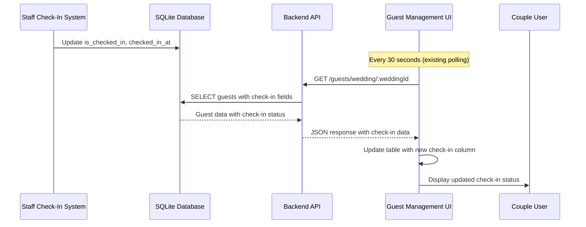

# Design Document: Guest Check-In Status Display

## Overview

This design enhances the existing guest management table to display check-in status information. The enhancement leverages the existing check-in infrastructure (database fields, API endpoints, and real-time polling) while adding a new column to the guest table with appropriate visual indicators and filtering capabilities.

The design focuses on minimal changes to the existing codebase while providing maximum value to couples who want to monitor guest arrivals in real-time.

## Architecture

### System Context

The enhancement integrates with the existing three-tier architecture:

1. **Database Layer**: SQLite database with existing `is_checked_in` and `checked_in_at` fields in the `guests` table
2. **API Layer**: Node.js/Express backend with existing `/guests/wedding/:weddingId` endpoint that already returns check-in data
3. **Frontend Layer**: React/TypeScript frontend with TanStack Query for data management and real-time updates

### Data Flow



### Integration Points

- **Existing API**: No changes required - the `/guests/wedding/:weddingId` endpoint already returns `is_checked_in` and `checked_in_at` fields
- **Existing Polling**: Leverages the current 30-second `refetchInterval` in the `useQuery` hook
- **Existing Type System**: The `Guest` interface already includes the required check-in fields

## Components and Interfaces

### Frontend Components

#### GuestList Component Enhancement

**Location**: `frontend/src/components/guests/GuestList.tsx`

**Changes Required**:
1. Add new table header column for "Checked In"
2. Add new table cell component for check-in status display
3. Enhance filtering state and logic
4. Update CSV export functionality

**New State Variables**:
```typescript
// Add to existing filter state
const [checkInFilter, setCheckInFilter] = useState<'all' | 'checked_in' | 'not_checked_in'>('all');
```

**Enhanced Filtering Logic**:
```typescript
const filteredGuests = guests.filter(guest => {
  const matchesSearch = /* existing search logic */;
  const matchesRSVP = /* existing RSVP logic */;
  const matchesCheckIn = checkInFilter === 'all' ||
                         (checkInFilter === 'checked_in' && guest.is_checked_in) ||
                         (checkInFilter === 'not_checked_in' && !guest.is_checked_in);
  
  return matchesSearch && matchesRSVP && matchesCheckIn;
});
```

#### CheckInStatusCell Component (New)

**Purpose**: Displays check-in status with appropriate visual indicators

**Props Interface**:
```typescript
interface CheckInStatusCellProps {
  isCheckedIn: boolean;
  checkedInAt?: string;
}
```

**Visual States**:
- **Checked In**: Green checkmark icon + "✓ Checked In" badge + formatted timestamp
- **Not Checked In**: Gray circle icon + "Pending" text

**Implementation**:
```typescript
const CheckInStatusCell: React.FC<CheckInStatusCellProps> = ({ isCheckedIn, checkedInAt }) => {
  if (isCheckedIn && checkedInAt) {
    return (
      <div>
        <span className="inline-flex items-center px-2.5 py-1 rounded-full text-xs font-medium bg-emerald-100 dark:bg-emerald-900/30 text-emerald-700 dark:text-emerald-400">
          ✓ Checked In
        </span>
        <p className="text-xs text-slate-500 dark:text-slate-400 mt-1">
          {new Date(checkedInAt).toLocaleString()}
        </p>
      </div>
    );
  }
  
  return (
    <span className="inline-flex items-center px-2.5 py-1 rounded-full text-xs font-medium bg-slate-100 dark:bg-slate-800 text-slate-700 dark:text-slate-300">
      Pending
    </span>
  );
};
```

### Data Models

**No changes required** - the existing `Guest` interface already includes:
```typescript
interface Guest {
  // ... existing fields
  is_checked_in: boolean;
  checked_in_at?: string;
  // ... other fields
}
```

### API Integration

**No backend changes required** - the existing endpoint already provides the necessary data:

```javascript
// backend-node/routes/guests.js - existing query already includes check-in fields
const guestsResult = await query(`
  SELECT id, name, email, phone, qr_code, table_number, dietary_restrictions,
         is_checked_in, checked_in_at, created_at,
         rsvp_status, rsvp_message, rsvp_responded_at
  FROM guests 
  WHERE wedding_id = $1
  ORDER BY name ASC
`, [weddingId]);
```

## Correctness Properties

*A property is a characteristic or behavior that should hold true across all valid executions of a system-essentially, a formal statement about what the system should do. Properties serve as the bridge between human-readable specifications and machine-verifiable correctness guarantees.*

### Property 1: Check-In Status Display

*For any* guest in the guest management table, the displayed check-in status should correctly reflect the guest's `is_checked_in` field value, showing appropriate visual indicators (checkmark for checked-in, pending for not checked-in).

**Validates: Requirements 1.2, 1.3, 4.1, 4.2**

### Property 2: Timestamp Display and Formatting

*For any* guest with check-in data, if the guest is checked-in and has a `checked_in_at` timestamp, the system should display a formatted timestamp below the status indicator, and if the guest is not checked-in, no timestamp should be displayed.

**Validates: Requirements 2.1, 2.2, 2.3**

### Property 3: Data Change Reactivity

*For any* change to guest check-in data, when the underlying guest data is updated, both the status indicator and timestamp (if applicable) should reflect the new values in the UI.

**Validates: Requirements 3.2**

### Property 4: Existing Functionality Preservation

*For any* existing guest management operation (search, filter, sort, edit, delete, send invitations), the functionality should continue to work correctly after adding the check-in status column.

**Validates: Requirements 5.1, 5.2, 5.4**

### Property 5: CSV Export Integration

*For any* CSV export operation, the exported data should include check-in status as "Yes/No", include timestamps for checked-in guests, and format timestamps in ISO format.

**Validates: Requirements 6.1, 6.2, 6.3**

### Property 6: Filter Statistics Update

*For any* filter operation (including check-in filters), the guest count statistics should accurately reflect the number of guests matching the applied filters.

**Validates: Requirements 7.3**

### Property 7: Filter Combination

*For any* combination of check-in filters with existing RSVP and search filters, the system should return guests that match all applied filter criteria.

**Validates: Requirements 7.4**

## Error Handling

### Frontend Error Scenarios

1. **Missing Check-In Data**: If `checked_in_at` is null but `is_checked_in` is true, display status without timestamp
2. **Invalid Timestamp Format**: If `checked_in_at` contains invalid date data, display status but show "Invalid date" for timestamp
3. **Network Failures**: Existing error handling in TanStack Query will manage API failures - no additional error handling needed

### Data Consistency

- The system relies on the existing database constraints and API validation
- Check-in status is managed by the staff check-in system, so the guest management UI is read-only for this data
- No additional validation required as the UI only displays existing data

## Testing Strategy

### Dual Testing Approach

The testing strategy combines unit tests for specific examples and edge cases with property-based tests for universal properties across all inputs.

**Unit Tests**:
- Test specific UI examples (column header presence, filter button functionality)
- Test edge cases (missing timestamps, invalid dates)
- Test integration points (CSV export format, filter combinations)

**Property-Based Tests**:
- Test universal properties across all guest data variations
- Verify status display correctness for any guest state
- Validate filter behavior across any combination of criteria
- Ensure existing functionality preservation across any guest data set

**Property Test Configuration**:
- Use React Testing Library with Jest for frontend testing
- Configure each property test to run minimum 100 iterations
- Tag each test with format: **Feature: guest-checkin-status-display, Property {number}: {property_text}**
- Each correctness property must be implemented by a single property-based test

**Test Coverage Areas**:
1. **Component Rendering**: Verify correct display of check-in status for various guest states
2. **Data Transformation**: Test timestamp formatting and status indicator logic
3. **Filter Logic**: Validate filter combinations and statistics updates
4. **Export Functionality**: Test CSV generation with check-in data
5. **Regression Testing**: Ensure existing functionality remains intact

### Testing Tools

- **Frontend**: Jest + React Testing Library + @testing-library/jest-dom
- **Property Testing**: fast-check library for JavaScript property-based testing
- **Component Testing**: React component testing with various guest data states
- **Integration Testing**: Test interaction between filters, search, and check-in status

The testing approach ensures both specific functionality works correctly (unit tests) and universal properties hold across all possible inputs (property tests), providing comprehensive coverage for the check-in status display enhancement.