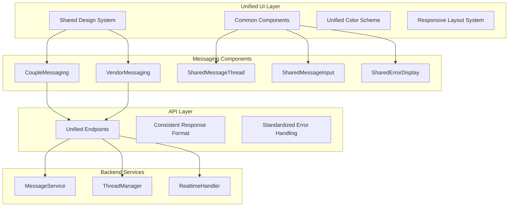

# Design Document: Messaging UI Consistency Fixes

## Overview

This design addresses critical inconsistencies between the Couple Dashboard Communication interface and the Vendor Portal Messages interface. The current system suffers from divergent UI patterns, broken functionality, and inconsistent API designs that create a fragmented user experience.

The solution involves unifying the visual design language, fixing broken messaging functionality, standardizing API patterns, and ensuring consistent mobile responsiveness across both interfaces.

## Architecture

### Current State Analysis

**Couple Dashboard Messaging (`CoupleMessaging.tsx`)**:
- Uses blue color scheme (`bg-blue-50`, `border-blue-200`, `text-blue-600`)
- Consistent mobile responsiveness with conditional rendering
- Proper error handling with retry mechanisms
- Uses `/api/v1/messaging/couple/` endpoints
- Implements proper message persistence and real-time updates

**Vendor Portal Messaging (`VendorMessaging.tsx`)**:
- Uses rose color scheme (`bg-rose-100`, `text-rose-600`, `border-rose-500`)
- Limited mobile optimization
- WebSocket-only message sending (no persistence)
- Uses `/api/v1/messaging/threads` endpoints
- Missing read status updates and proper error handling

### Target Architecture



## Components and Interfaces

### 1. Unified Design System

**Color Scheme Standardization**:
- Primary: Blue (`blue-600`, `blue-50`, `blue-200`) - matches couple interface
- Secondary: Gray (`gray-100`, `gray-200`, `gray-600`)
- Success: Green (`green-600`, `green-50`)
- Error: Red (`red-600`, `red-50`)
- Warning: Yellow (`yellow-600`, `yellow-50`)

**Typography**:
- Headers: `text-lg font-semibold text-gray-900`
- Body: `text-sm text-gray-600`
- Captions: `text-xs text-gray-400`

**Spacing**:
- Container padding: `p-4`
- Element margins: `mb-4`, `mr-2`
- Border radius: `rounded-lg`

### 2. Shared Component Library

**SharedMessageThread Component**:
```typescript
interface SharedMessageThreadProps {
  messages: Message[];
  currentUserId: string;
  currentUserType: UserType;
  colorScheme?: 'blue' | 'rose'; // Temporary for migration
  onMessageRead?: (messageId: string) => void;
  onMessageDelete?: (messageId: string) => void;
}
```

**SharedMessageInput Component**:
```typescript
interface SharedMessageInputProps {
  threadId: string;
  onSendMessage: (content: string, type: MessageType, files?: File[]) => Promise<void>;
  onTypingStart?: () => void;
  onTypingStop?: () => void;
  disabled?: boolean;
  placeholder?: string;
  maxFileSize?: number;
  allowedFileTypes?: string[];
}
```

**SharedErrorDisplay Component**:
```typescript
interface SharedErrorDisplayProps {
  error: string | Error;
  onRetry?: () => void;
  onDismiss?: () => void;
  variant?: 'inline' | 'modal' | 'toast';
}
```

### 3. Mobile Responsive System

**Breakpoint Strategy**:
- Mobile: `< 768px` - Single column, full-width components
- Tablet: `768px - 1024px` - Adaptive two-column layout
- Desktop: `> 1024px` - Full three-column layout

**Mobile Navigation Pattern**:
```typescript
interface MobileNavigationState {
  showThreadList: boolean;
  showMessageView: boolean;
  selectedThread: Thread | null;
}

// Navigation flow:
// Mobile: ThreadList -> MessageView (with back button)
// Desktop: ThreadList + MessageView (side by side)
```

### 4. API Standardization

**Unified Endpoint Structure**:
```
/api/v1/messaging/
├── threads/                    # Thread management
│   ├── GET /                  # Get user's threads
│   ├── POST /                 # Create new thread
│   ├── GET /:id               # Get specific thread
│   └── PUT /:id/read          # Mark thread as read
├── messages/                   # Message operations
│   ├── GET /:threadId         # Get thread messages
│   ├── POST /                 # Send message
│   ├── PUT /:id/read          # Mark message as read
│   └── DELETE /:id            # Delete message
└── search/                     # Search functionality
    └── GET /:threadId         # Search messages in thread
```

**Standardized Response Format**:
```typescript
interface APIResponse<T> {
  success: boolean;
  data?: T;
  error?: {
    code: string;
    message: string;
    details?: unknown;
  };
  pagination?: {
    total: number;
    limit: number;
    offset: number;
    hasMore: boolean;
  };
}
```

## Data Models

### Unified Thread Interface

```typescript
interface UnifiedThread {
  id: string;
  participants: {
    couple: {
      id: string;
      name: string;
      avatar?: string;
    };
    vendor: {
      id: string;
      name: string;
      businessName: string;
      category: string;
      avatar?: string;
      isVerified?: boolean;
    };
  };
  lastMessage: {
    content: string;
    timestamp: Date;
    senderId: string;
    senderType: UserType;
  };
  unreadCount: number;
  status: 'active' | 'archived';
  metadata: {
    leadId?: string;
    serviceType?: string;
  };
  createdAt: Date;
  updatedAt: Date;
}
```

### Enhanced Message Interface

```typescript
interface EnhancedMessage extends Message {
  // Add read status for all participants
  readStatus: {
    [userId: string]: {
      readAt: Date;
      userType: UserType;
    };
  };
  
  // Add delivery confirmation
  deliveryStatus: 'sent' | 'delivered' | 'failed';
  
  // Add retry mechanism for failed messages
  retryCount?: number;
  lastRetryAt?: Date;
}
```

### Mobile Layout Configuration

```typescript
interface MobileLayoutConfig {
  breakpoints: {
    mobile: number;    // 768
    tablet: number;    // 1024
    desktop: number;   // 1280
  };
  
  layouts: {
    mobile: {
      threadListWidth: '100%';
      messageViewWidth: '100%';
      showBothViews: false;
    };
    tablet: {
      threadListWidth: '40%';
      messageViewWidth: '60%';
      showBothViews: true;
    };
    desktop: {
      threadListWidth: '33%';
      messageViewWidth: '67%';
      showBothViews: true;
    };
  };
}
```

## Correctness Properties

*A property is a characteristic or behavior that should hold true across all valid executions of a system-essentially, a formal statement about what the system should do. Properties serve as the bridge between human-readable specifications and machine-verifiable correctness guarantees.*

Let me analyze the acceptance criteria to determine which ones are testable as properties:

<function_calls>
<invoke name="prework">
<parameter name="featureName">messaging-ui-consistency-fixes

Based on the prework analysis, I need to perform a property reflection to eliminate redundancy before writing the final properties:

**Property Reflection:**

After reviewing all testable properties, I identified several areas where properties can be consolidated:

1. **UI Consistency Properties (1.1-1.5)** can be combined into comprehensive visual consistency properties
2. **Message Persistence Properties (2.1-2.5)** can be consolidated into persistence and error handling properties  
3. **Real-time Properties (3.1-3.5)** can be combined into real-time synchronization properties
4. **Read Status Properties (4.1-4.5)** can be consolidated into read status management properties
5. **Mobile Properties (5.1, 5.2, 5.4, 5.5)** can be combined into mobile responsiveness properties
6. **Search Properties (6.1-6.4)** can be consolidated into search functionality properties
7. **Error Handling Properties (7.1-7.5)** can be combined into comprehensive error handling properties
8. **API Properties (8.1-8.5)** can be consolidated into API consistency properties
9. **Thread Management Properties (9.1-9.5)** can be combined into thread management properties
10. **Performance Properties (10.1-10.5)** can be consolidated into performance and feedback properties

### Correctness Properties

Property 1: **UI Visual Consistency**
*For any* equivalent UI element (buttons, inputs, message bubbles, timestamps) across couple and vendor interfaces, the styling, colors, typography, and layout should be identical
**Validates: Requirements 1.1, 1.2, 1.4, 1.5**

Property 2: **Mobile Responsive Consistency**  
*For any* viewport size change or orientation change, both couple and vendor interfaces should adapt their layouts identically and provide appropriate touch targets
**Validates: Requirements 1.3, 5.1, 5.2, 5.4, 5.5**

Property 3: **Message Persistence**
*For any* message sent through either interface, the message should be immediately stored in the database and retrievable by both sender and recipient across sessions
**Validates: Requirements 2.1, 2.2, 2.3**

Property 4: **Message Ordering Consistency**
*For any* set of messages in a thread, retrieving the message history should always return messages in chronological order by creation timestamp
**Validates: Requirements 2.4**

Property 5: **Error Handling with Retry**
*For any* failed operation (message send, load, etc.), the system should display a clear error message with retry functionality and clear the error when resolved
**Validates: Requirements 2.5, 7.1, 7.4, 7.5**

Property 6: **Real-time Message Synchronization**
*For any* message sent or received, all active participants in the conversation should see the message appear immediately in their interface
**Validates: Requirements 3.1, 3.2, 3.5**

Property 7: **Connection Recovery**
*For any* WebSocket connection loss, the system should automatically attempt reconnection and sync any missed messages upon reconnection
**Validates: Requirements 3.3, 3.4, 7.2**

Property 8: **Read Status Management**
*For any* message displayed to a recipient, the message should be marked as read, the sender should see read indicators, and unread counts should be accurate across all interfaces
**Validates: Requirements 4.1, 4.2, 4.3, 4.4, 4.5**

Property 9: **Search and Filter Functionality**
*For any* search query or filter applied, only matching results should be displayed, with proper highlighting and the ability to clear filters to return to full view
**Validates: Requirements 6.1, 6.2, 6.3, 6.4**

Property 10: **API Consistency**
*For any* equivalent messaging operation, both couple and vendor interfaces should use consistent URL patterns, request/response formats, authentication, and error response structures
**Validates: Requirements 8.1, 8.2, 8.3, 8.4, 8.5**

Property 11: **Thread Management**
*For any* thread list, threads should be sorted by most recent activity, move to top when new messages arrive, show accurate previews and unread indicators, and update immediately when modified
**Validates: Requirements 9.1, 9.2, 9.3, 9.4, 9.5**

Property 12: **Performance and Loading States**
*For any* operation that takes time (loading messages, sending, switching conversations), appropriate loading indicators should be shown, operations should complete within reasonable time limits, and progress feedback should be provided for bulk operations
**Validates: Requirements 10.1, 10.2, 10.3, 10.4, 10.5**

## Error Handling

### Error Categories

1. **Network Errors**
   - Connection timeouts
   - WebSocket disconnections
   - API endpoint failures
   - Rate limiting responses

2. **Validation Errors**
   - Empty message content
   - File size/type restrictions
   - Invalid thread access
   - Authentication failures

3. **Persistence Errors**
   - Database write failures
   - Message encryption errors
   - File upload failures
   - Cache synchronization issues

4. **UI State Errors**
   - Component rendering failures
   - State synchronization issues
   - Mobile layout problems
   - Search/filter malfunctions

### Error Recovery Strategies

**Automatic Recovery**:
- WebSocket reconnection with exponential backoff
- Message queue for offline scenarios
- Cache invalidation and refresh
- State reconciliation after errors

**User-Initiated Recovery**:
- Retry buttons for failed operations
- Manual refresh options
- Clear cache functionality
- Reset to default state options

**Error Prevention**:
- Input validation before submission
- Connection status monitoring
- Proactive cache warming
- Graceful degradation for missing features

## Testing Strategy

### Dual Testing Approach

**Unit Tests**: Focus on specific components, edge cases, and error conditions
- Component rendering with various props
- Error boundary behavior
- Mobile responsive breakpoints
- API response parsing
- State management edge cases

**Property-Based Tests**: Verify universal properties across all inputs with minimum 100 iterations per test
- UI consistency across different data sets
- Message persistence across various message types
- Real-time synchronization with multiple clients
- Search functionality with random queries
- Error handling with various failure scenarios

### Property Test Configuration

Each property test will be tagged with:
**Feature: messaging-ui-consistency-fixes, Property {number}: {property_text}**

Example property test structure:
```typescript
describe('Property 1: UI Visual Consistency', () => {
  it('should maintain identical styling across interfaces', () => {
    fc.assert(fc.property(
      fc.record({
        messageContent: fc.string(),
        timestamp: fc.date(),
        senderType: fc.constantFrom('couple', 'vendor')
      }),
      (testData) => {
        const coupleElement = renderCoupleMessage(testData);
        const vendorElement = renderVendorMessage(testData);
        
        // Verify identical CSS classes and computed styles
        expect(getComputedStyles(coupleElement)).toEqual(
          getComputedStyles(vendorElement)
        );
      }
    ), { numRuns: 100 });
  });
});
```

### Testing Libraries

- **Frontend**: Jest, React Testing Library, fast-check for property testing
- **Backend**: Jest, Supertest for API testing, fast-check for property testing
- **E2E**: Playwright for cross-browser testing
- **Visual**: Chromatic for visual regression testing

### Test Coverage Requirements

- **Unit Tests**: 90% code coverage minimum
- **Property Tests**: All 12 correctness properties implemented
- **Integration Tests**: All API endpoints and WebSocket events
- **E2E Tests**: Critical user journeys for both interfaces
- **Visual Tests**: All UI components in various states

The testing strategy ensures comprehensive validation of both specific examples and universal correctness properties, providing confidence in the system's reliability and consistency.