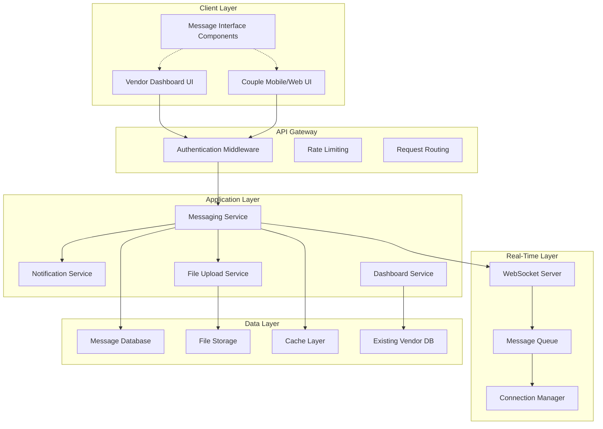

# Design Document: Vendor Dashboard Messaging Enhancement

## Overview

This design outlines the enhancement of the existing vendor dashboard by implementing a comprehensive real-time messaging system between couples and vendors. The solution addresses current dashboard stability issues while introducing secure, scalable messaging capabilities that integrate seamlessly with existing vendor management features.

The system will leverage WebSocket technology for real-time communication, implement end-to-end encryption for message security, and provide a responsive interface that works across desktop and mobile platforms. The design emphasizes performance, security, and user experience while maintaining compatibility with the existing wedding platform infrastructure.

## Architecture

### High-Level Architecture



### Technology Stack

**Frontend:**
- React/TypeScript for dashboard components
- Socket.io-client for WebSocket connections
- React Query for state management and caching
- Tailwind CSS for responsive styling

**Backe
nd:**
- Node.js/Express.js for API services
- Socket.io for WebSocket server implementation
- Redis for session management and message queuing
- Bull Queue for background job processing

**Database:**
- PostgreSQL for message storage and conversation threads
- Redis for real-time data caching
- AWS S3 or similar for file storage

**Security:**
- AES-256 encryption for message content
- JWT tokens for authentication
- HTTPS/WSS for secure transport
- Rate limiting and input validation

## Components and Interfaces

### Core Components

#### 1. Message Thread Manager
Handles conversation thread creation, management, and retrieval.

**Interface:**
```typescript
interface MessageThread {
  id: string;
  participants: {
    coupleId: string;
    vendorId: string;
  };
  createdAt: Date;
  updatedAt: Date;
  lastMessageAt: Date;
  isActive: boolean;
  metadata: {
    leadId?: string;
    serviceType?: string;
  };
}

interface ThreadManager {
  createThread(coupleId: string, vendorId: string, metadata?: object): Promise<MessageThread>;
  getThread(threadId: string): Promise<MessageThread>;
  getThreadsForUser(userId: string, userType: 'couple' | 'vendor'): Promise<MessageThread[]>;
  updateThreadActivity(threadId: string): Promise<void>;
  archiveThread(threadId: string): Promise<void>;
}
```

#### 2. Message Service
Core messaging functionality for sending, receiving, and storing messages.

**Interface:**
```typescript
interface Message {
  id: string;
  threadId: string;
  senderId: string;
  senderType: 'couple' | 'vendor';
  content: string; // encrypted
  messageType: 'text' | 'image' | 'document' | 'system';
  attachments?: Attachment[];
  createdAt: Date;
  status: 'sent' | 'delivered' | 'read';
  isDeleted: boolean;
}

interface MessageService {
  sendMessage(threadId: string, senderId: string, content: string, type: MessageType): Promise<Message>;
  getMessages(threadId: string, limit: number, offset: number): Promise<Message[]>;
  markAsRead(messageId: string, userId: string): Promise<void>;
  deleteMessage(messageId: string, userId: string): Promise<void>;
  searchMessages(threadId: string, query: string): Promise<Message[]>;
}
```

#### 3. Real-Time Communication Handler
Manages WebSocket connections and real-time message delivery.

**Interface:**
```typescript
interface ConnectionManager {
  connect(userId: string, userType: 'couple' | 'vendor'): Promise<WebSocket>;
  disconnect(userId: string): Promise<void>;
  broadcastToThread(threadId: string, message: Message): Promise<void>;
  sendTypingIndicator(threadId: string, userId: string, isTyping: boolean): Promise<void>;
  getOnlineUsers(threadId: string): Promise<string[]>;
}

interface RealtimeHandler {
  onMessageReceived(callback: (message: Message) => void): void;
  onTypingIndicator(callback: (threadId: string, userId: string, isTyping: boolean) => void): void;
  onUserStatusChange(callback: (userId: string, isOnline: boolean) => void): void;
  emitMessage(message: Message): Promise<void>;
  emitTyping(threadId: string, isTyping: boolean): Promise<void>;
}
```

#### 4. Notification Service
Handles push notifications and alert management.

**Interface:**
```typescript
interface NotificationService {
  sendMessageNotification(recipientId: string, message: Message): Promise<void>;
  sendTypingNotification(recipientId: string, threadId: string, senderName: string): Promise<void>;
  markNotificationAsRead(notificationId: string): Promise<void>;
  getUserNotificationPreferences(userId: string): Promise<NotificationPreferences>;
  updateNotificationPreferences(userId: string, preferences: NotificationPreferences): Promise<void>;
}

interface NotificationPreferences {
  emailNotifications: boolean;
  pushNotifications: boolean;
  smsNotifications: boolean;
  quietHours: {
    start: string;
    end: string;
  };
}
```

#### 5. File Upload Service
Manages media and document sharing within messages.

**Interface:**
```typescript
interface Attachment {
  id: string;
  messageId: string;
  fileName: string;
  fileType: string;
  fileSize: number;
  url: string;
  thumbnailUrl?: string;
  uploadedAt: Date;
}

interface FileUploadService {
  uploadFile(file: File, messageId: string): Promise<Attachment>;
  generateThumbnail(attachment: Attachment): Promise<string>;
  validateFile(file: File): Promise<boolean>;
  deleteFile(attachmentId: string): Promise<void>;
  getFileUrl(attachmentId: string): Promise<string>;
}
```

#### 6. Dashboard Integration Service
Connects messaging system with existing vendor dashboard features.

**Interface:**
```typescript
interface DashboardIntegration {
  linkMessageToLead(messageId: string, leadId: string): Promise<void>;
  createThreadFromLead(leadId: string): Promise<MessageThread>;
  getVendorProfile(vendorId: string): Promise<VendorProfile>;
  updateVendorOnlineStatus(vendorId: string, isOnline: boolean): Promise<void>;
  getMessagingAnalytics(vendorId: string, dateRange: DateRange): Promise<MessagingAnalytics>;
}

interface MessagingAnalytics {
  totalMessages: number;
  responseTime: number;
  activeConversations: number;
  messagesByDay: { date: string; count: number }[];
}
```

## Data Models

### Database Schema

#### Messages Table
```sql
CREATE TABLE messages (
    id UUID PRIMARY KEY DEFAULT gen_random_uuid(),
    thread_id UUID NOT NULL REFERENCES message_threads(id),
    sender_id UUID NOT NULL,
    sender_type VARCHAR(10) NOT NULL CHECK (sender_type IN ('couple', 'vendor')),
    content TEXT NOT NULL, -- encrypted
    message_type VARCHAR(20) NOT NULL DEFAULT 'text',
    created_at TIMESTAMP WITH TIME ZONE DEFAULT NOW(),
    updated_at TIMESTAMP WITH TIME ZONE DEFAULT NOW(),
    status VARCHAR(20) NOT NULL DEFAULT 'sent',
    is_deleted BOOLEAN DEFAULT FALSE,
    
    INDEX idx_messages_thread_created (thread_id, created_at),
    INDEX idx_messages_sender (sender_id),
    INDEX idx_messages_status (status)
);
```

#### Message Threads Table
```sql
CREATE TABLE message_threads (
    id UUID PRIMARY KEY DEFAULT gen_random_uuid(),
    couple_id UUID NOT NULL,
    vendor_id UUID NOT NULL,
    created_at TIMESTAMP WITH TIME ZONE DEFAULT NOW(),
    updated_at TIMESTAMP WITH TIME ZONE DEFAULT NOW(),
    last_message_at TIMESTAMP WITH TIME ZONE DEFAULT NOW(),
    is_active BOOLEAN DEFAULT TRUE,
    lead_id UUID REFERENCES leads(id),
    service_type VARCHAR(50),
    
    UNIQUE(couple_id, vendor_id),
    INDEX idx_threads_couple (couple_id),
    INDEX idx_threads_vendor (vendor_id),
    INDEX idx_threads_last_message (last_message_at)
);
```

#### Message Attachments Table
```sql
CREATE TABLE message_attachments (
    id UUID PRIMARY KEY DEFAULT gen_random_uuid(),
    message_id UUID NOT NULL REFERENCES messages(id) ON DELETE CASCADE,
    file_name VARCHAR(255) NOT NULL,
    file_type VARCHAR(100) NOT NULL,
    file_size INTEGER NOT NULL,
    file_url TEXT NOT NULL,
    thumbnail_url TEXT,
    uploaded_at TIMESTAMP WITH TIME ZONE DEFAULT NOW(),
    
    INDEX idx_attachments_message (message_id)
);
```

#### Message Read Status Table
```sql
CREATE TABLE message_read_status (
    id UUID PRIMARY KEY DEFAULT gen_random_uuid(),
    message_id UUID NOT NULL REFERENCES messages(id) ON DELETE CASCADE,
    user_id UUID NOT NULL,
    read_at TIMESTAMP WITH TIME ZONE DEFAULT NOW(),
    
    UNIQUE(message_id, user_id),
    INDEX idx_read_status_user (user_id),
    INDEX idx_read_status_message (message_id)
);
```

#### User Connection Status Table
```sql
CREATE TABLE user_connection_status (
    user_id UUID PRIMARY KEY,
    user_type VARCHAR(10) NOT NULL CHECK (user_type IN ('couple', 'vendor')),
    is_online BOOLEAN DEFAULT FALSE,
    last_seen TIMESTAMP WITH TIME ZONE DEFAULT NOW(),
    socket_id VARCHAR(255),
    
    INDEX idx_connection_status_online (is_online),
    INDEX idx_connection_status_last_seen (last_seen)
);
```

### Encryption Strategy

**Message Content Encryption:**
- Use AES-256-GCM for symmetric encryption of message content
- Generate unique encryption keys per conversation thread
- Store encryption keys separately from message content
- Implement key rotation every 90 days

**Key Management:**
```typescript
interface EncryptionService {
  encryptMessage(content: string, threadId: string): Promise<string>;
  decryptMessage(encryptedContent: string, threadId: string): Promise<string>;
  generateThreadKey(threadId: string): Promise<string>;
  rotateThreadKey(threadId: string): Promise<void>;
}
```

## Error Handling

### Error Categories and Responses

#### 1. Connection Errors
- **WebSocket Connection Failed**: Implement exponential backoff retry mechanism
- **Network Timeout**: Queue messages locally and retry when connection restored
- **Authentication Failure**: Redirect to login and clear cached credentials

#### 2. Message Delivery Errors
- **Message Send Failed**: Store in local queue and retry with exponential backoff
- **Encryption/Decryption Error**: Log error and display generic error message to user
- **File Upload Failed**: Provide retry option and fallback to text-only message

#### 3. Database Errors
- **Connection Pool Exhausted**: Implement circuit breaker pattern
- **Query Timeout**: Implement query optimization and caching strategies
- **Constraint Violations**: Validate data before database operations

#### 4. Rate Limiting
- **Message Rate Exceeded**: Display warning and implement client-side throttling
- **File Upload Rate Exceeded**: Queue uploads and process sequentially
- **Connection Rate Exceeded**: Implement connection pooling and reuse

### Error Recovery Strategies

```typescript
interface ErrorHandler {
  handleConnectionError(error: ConnectionError): Promise<void>;
  handleMessageError(error: MessageError, message: Message): Promise<void>;
  handleFileUploadError(error: FileUploadError, file: File): Promise<void>;
  retryWithBackoff<T>(operation: () => Promise<T>, maxRetries: number): Promise<T>;
}
```

## Testing Strategy

### Dual Testing Approach

The testing strategy combines unit tests for specific functionality with property-based tests for comprehensive validation of system behavior across all possible inputs.

**Unit Testing Focus:**
- Specific message formatting and validation examples
- Error handling scenarios and edge cases
- Integration points between messaging and existing dashboard features
- File upload validation and security checks

**Property-Based Testing Focus:**
- Universal message delivery and consistency properties
- Encryption/decryption round-trip validation
- Thread management and conversation integrity
- Real-time synchronization across multiple clients

### Property-Based Testing Configuration

**Testing Library:** fast-check (JavaScript/TypeScript)
**Test Configuration:** Minimum 100 iterations per property test
**Tagging Format:** Each test tagged with `Feature: vendor-dashboard-messaging-enhancement, Property {number}: {property_text}`

### Testing Environment Setup

```typescript
// Example property test configuration
import fc from 'fast-check';

describe('Message System Properties', () => {
  it('should maintain message order in threads', () => {
    fc.assert(fc.property(
      fc.array(fc.record({
        content: fc.string(),
        timestamp: fc.date(),
        senderId: fc.uuid()
      })),
      (messages) => {
        // Property test implementation
        const sortedMessages = sortMessagesByTimestamp(messages);
        return isChronologicallyOrdered(sortedMessages);
      }
    ), { numRuns: 100 });
  });
});
```

Now I need to use the prework tool to analyze the acceptance criteria before writing the correctness properties.

<function_calls>
<invoke name="prework">
<parameter name="featureName">vendor-dashboard-messaging-enhancement

## Correctness Properties

*A property is a characteristic or behavior that should hold true across all valid executions of a system—essentially, a formal statement about what the system should do. Properties serve as the bridge between human-readable specifications and machine-verifiable correctness guarantees.*

Based on the prework analysis and property reflection to eliminate redundancy, the following properties validate the core correctness requirements of the vendor dashboard messaging enhancement:

### Property 1: Dashboard Performance and Reliability
*For any* vendor dashboard access request, the system should load successfully within the specified time threshold and process all valid vendor actions without failures.
**Validates: Requirements 1.1, 1.3**

### Property 2: Error Handling and Recovery
*For any* system error condition, the dashboard should display appropriate error messages and provide recovery options to maintain system usability.
**Validates: Requirements 1.4**

### Property 3: Message Delivery and Thread Synchronization
*For any* message sent between couples and vendors, the message should be delivered instantly, confirmed with status indicators, and update conversation threads immediately for both participants.
**Validates: Requirements 2.1, 2.3, 2.5**

### Property 4: Real-time Communication Features
*For any* online vendor-couple interaction, typing indicators should be displayed correctly and network interruptions should not cause message loss after reconnection.
**Validates: Requirements 2.2, 2.4**

### Property 5: Thread Integrity and Message Ordering
*For any* conversation thread, messages should be displayed chronologically, pagination should maintain continuity, and message deletion should not break thread integrity for other participants.
**Validates: Requirements 3.1, 3.3, 3.5**

### Property 6: Message Search Functionality
*For any* search query within a conversation context, the system should return relevant results that match the search criteria.
**Validates: Requirements 3.2**

### Property 7: Attachment Handling
*For any* message containing attachments or media, the system should preserve and display them correctly within the conversation thread.
**Validates: Requirements 3.4**

### Property 8: Message Encryption Round-trip
*For any* message content, encrypting then decrypting should produce the original message, ensuring data integrity and security.
**Validates: Requirements 4.1**

### Property 9: Authorization and Access Control
*For any* message access request, the system should verify user authorization before displaying content and deny unauthorized access attempts.
**Validates: Requirements 4.2, 4.5**

### Property 10: Comprehensive Notification Delivery
*For any* new message or status change, appropriate notifications should be sent to recipients, read status should update correctly, and offline users should receive queued notifications upon return.
**Validates: Requirements 5.1, 5.2, 5.3**

### Property 11: Priority Notification Handling
*For any* urgent message, the system should provide priority alerts with distinct indicators according to user preferences.
**Validates: Requirements 5.4, 5.5**

### Property 12: Cross-platform State Synchronization
*For any* user switching between desktop and mobile platforms, conversation state should synchronize seamlessly without data loss.
**Validates: Requirements 6.4**

### Property 13: File Upload Validation and Processing
*For any* file upload (images up to 10MB, PDFs up to 25MB), the system should validate format and size, generate thumbnails for media, and scan for malware before acceptance.
**Validates: Requirements 7.1, 7.2, 7.3, 7.5**

### Property 14: Dashboard Integration Consistency
*For any* messaging activity, the system should maintain proper integration with lead tracking, profile updates, service bookings, reviews, and analytics reporting.
**Validates: Requirements 8.1, 8.2, 8.3, 8.4, 8.5**

### Unit Test Examples and Edge Cases

The following specific scenarios should be covered by unit tests to complement the property-based testing:

- **Data Deletion Example**: When a user requests data deletion, verify that message data is permanently removed within 30 days (Requirements 4.4)
- **Empty message handling**: Ensure system gracefully handles empty or whitespace-only messages
- **Maximum file size edge cases**: Test behavior at exact file size limits (10MB for images, 25MB for PDFs)
- **Network timeout scenarios**: Verify proper handling of various network failure conditions
- **Concurrent user access**: Test specific scenarios with multiple users accessing the same conversation
- **Malformed message content**: Ensure system handles corrupted or malformed message data
- **Authentication token expiration**: Test message delivery when user tokens expire mid-conversation

### Testing Implementation Requirements

**Property-Based Testing Configuration:**
- Use fast-check library for JavaScript/TypeScript property testing
- Configure minimum 100 iterations per property test
- Tag each test with: `Feature: vendor-dashboard-messaging-enhancement, Property {number}: {property_text}`
- Implement custom generators for message content, user interactions, and file uploads

**Unit Testing Focus:**
- Specific integration points with existing vendor dashboard
- Error boundary conditions and edge cases
- Authentication and authorization workflows
- File upload validation and security checks

**Test Environment:**
- Mock WebSocket connections for real-time testing
- Use test databases with realistic data volumes
- Implement network simulation for connectivity testing
- Create test file uploads of various formats and sizes